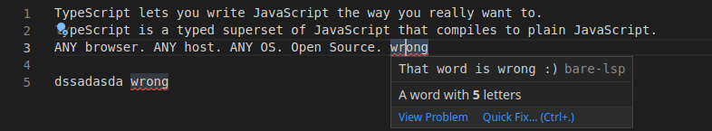

[first-extension]: https://code.visualstudio.com/api/get-started/your-first-extension
[vscode-lsp]: https://code.visualstudio.com/api/language-extensions/language-server-extension-guide
[packaging]: https://code.visualstudio.com/api/working-with-extensions/publishing-extension#packaging-extensions
[clangd]: https://github.com/clangd/vscode-clangd/blob/master/src/clangd-context.ts

# bare-lsp VSCode Extension

## Setup
Be sure your system as a recent version of both [nodejs](https://nodejs.org/) and [npm](https://www.npmjs.com/).
From the current directory, run `npm install`.

Be sure to have a compiled `lsp-server` in the parent directory, and update `package.json` to point to
the lsp-server binary:

``` json
    "contributes": {
        "configuration": {
            "type": "object",
            "title": "Bare LSP configuration",
            "properties": {
                "languageBareLSP.serverPath": {
                    "scope": "workspace",
                    "type": "string",
                    "default": "<default location>",
```

Once done, we can now package the lsp vscode client. Run `npm run vsix` to generate the extension file `bare-lsp.vsix`.
Finally, run `code --install-extension bare-lsp.vsix` to install the extension.

To see the bare-lsp server in action, simply create and edit a text file.
This is what you should see:



# References

- [Your first extension][first-extension]
- [Language server extension guide][vscode-lsp]
- [Packaging the extension][packaging]
- [Clangd example][clangd]
